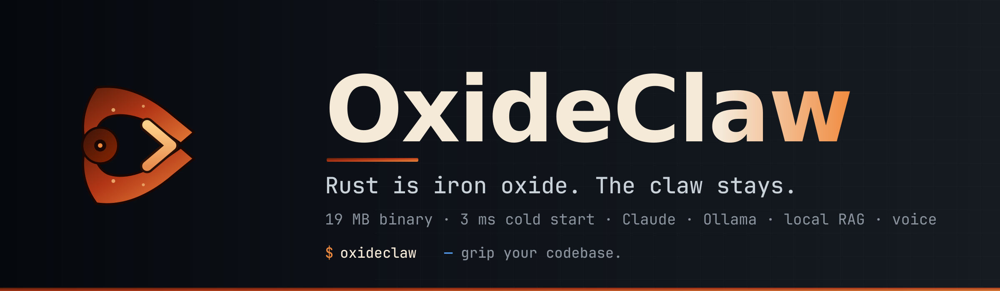

<p align="center">
  
</p>

<p align="center">
  <a href="https://github.com/ForkedInTime/OxideClaw/releases"></a>
  <a href="https://github.com/ForkedInTime/OxideClaw/actions/workflows/ci.yml"></a>
  <a href="LICENSE"></a>
  <a href="https://www.rust-lang.org"></a>
  <a href="https://github.com/ForkedInTime/OxideClaw/stargazers"></a>
</p>

<h3 align="center">OxideClaw is a single-binary coding agent that indexes your repo, routes each task to the cheapest capable model, fixes its own lint and test failures, and answers in your own voice.</h3>

<p align="center">
  Claude, Ollama, and 9 OpenAI-compatible providers. One 19 MB static binary, 3 ms cold start.<br>
  No Node. No Python. No <code>node_modules</code>. No flickering TUI.<br>
  <sub>Rust is iron oxide. The claw stays.</sub>
</p>

<p align="center"><sub>Formerly <b>RustyClaw</b> (renamed 2026-09-11). Existing installs keep working: <code>RUSTYCLAW_*</code> settings are still read, and config, sessions, index and undo history move to the new name on first run.</sub></p>

<p align="center">
  
</p>

---

## Install

**Linux / macOS:**
```bash
curl -fsSL https://raw.githubusercontent.com/ForkedInTime/OxideClaw/main/install.sh | bash
```

**Windows (PowerShell):**
```powershell
Invoke-WebRequest https://github.com/ForkedInTime/OxideClaw/releases/latest/download/oxideclaw-windows-x64.exe -OutFile oxideclaw.exe
```
Then move `oxideclaw.exe` somewhere on your `PATH` (e.g. `%USERPROFILE%\bin`).

**Arch Linux:**
```bash
git clone https://github.com/ForkedInTime/OxideClaw && cd OxideClaw/contrib/aur && makepkg -si
```

**Homebrew (macOS / Linux):**
```bash
brew install ForkedInTime/oxideclaw/oxideclaw
```

**Cargo (builds from source, any platform with Rust 1.86+):**
```bash
cargo install oxideclaw
```

<details>
<summary>Other install methods</summary>

**From source (Rust 2024 edition):**
```bash
git clone https://github.com/ForkedInTime/OxideClaw.git
cd OxideClaw && cargo build --release
./target/release/oxideclaw
```

**Specific version (Linux/macOS):**
```bash
curl -fsSL https://raw.githubusercontent.com/ForkedInTime/OxideClaw/main/install.sh | bash -s v0.4.0
```

Pre-built binaries attached to every [release](https://github.com/ForkedInTime/OxideClaw/releases):
- Linux: `x86_64-linux-gnu`, `aarch64-linux-gnu`, `x86_64-linux-musl`
- macOS: `x86_64-apple-darwin` (Intel), `aarch64-apple-darwin` (Apple Silicon)
- Windows: `oxideclaw-windows-x64.exe`
</details>

**Linux / macOS:**
```bash
echo 'ANTHROPIC_API_KEY=sk-ant-...' >> ~/.env
oxideclaw
```

**Windows (PowerShell):**
```powershell
"ANTHROPIC_API_KEY=sk-ant-..." | Out-File -FilePath $HOME\.env -Encoding utf8 -Append
oxideclaw
```

---

## Why OxideClaw?

OxideClaw is a coding agent, not a port. It talks to Claude, Ollama, and 9 OpenAI-compatible providers, and it builds the things only a native binary makes practical: an on-disk index of your codebase, a router that sends each task to the cheapest model that can handle it, agents that run in parallel git worktrees, a lint-and-test loop that fixes its own mistakes, and spoken answers in your own voice.

How it compares with the agents people actually run. Every cell was checked against the project's public README and source on 2026-09-11.
✅ documented · ❌ not offered · — not documented by the project.

| | Claude Code | Codewhale | jcode | claurst | **OxideClaw** |
|---|---|---|---|---|---|
| Runtime | JavaScript (Bun-bundled binary) | Rust | Rust | Rust | **Rust, one static binary** |
| License | Proprietary | MIT | MIT | GPL-3.0 | **Apache-2.0** |
| Zero-setup codebase index (tree-sitter + FTS5) | ❌ | — | — | — | **✅ 8 languages** |
| Auto model routing | ❌ | ✅ DeepSeek tiers | — | — | **✅ any provider, by task complexity, `/budget` cap** |
| Auto-fix loop (lint + tests + retry after every edit) | ❌ | — | — | — | **✅** |
| Spoken replies in a cloned voice | ❌ | ✅ cloud TTS tool (MiMo), on request | — | ❌ | **✅ local XTTS v2, every reply** |
| Autonomous browser agent (`/browse <goal>`) | ❌ | — | — | — | **✅ 50-step cap, approval gate** |
| `/redo` after `/undo` | — | — | — | — | **✅** |
| `/undo` | ✅ `/rewind` | ✅ `/undo`, `/restore` | — | — | **✅ hidden git refs, clean `git log`** |
| Parallel agents in git worktrees | ✅ | ✅ | ✅ swarm, no worktrees | ✅ | **✅ `spawn`, up to 8** |
| Voice input (Whisper) | ✅ | — | ✅ | ✅ | **✅** |
| Browser automation in the binary | via MCP | ✅ | ✅ | — | **✅ 9 CDP tools** |
| Ollama with native tool calling | ❌ | ✅ | ✅ | ✅ | **✅** |
| OpenAI-compatible providers | ❌ | ✅ | ✅ | ✅ | **✅ 9 providers** |
| Lifecycle hooks | ✅ | ✅ | — | ✅ | **✅ 8 events** |
| MCP servers | ✅ | ✅ | ✅ | ✅ | **✅** |
| Editor integration (Agent Client Protocol) | via adapter | — | — | ✅ | **✅ `oxideclaw acp`** |
| Sandboxed shell (bwrap / firejail) | ✅ | ✅ | — | — | **✅** |
| CLAUDE.md + AGENTS.md | CLAUDE.md | — | — | ✅ | **✅ both, `/reload`** |

The first seven rows are where OxideClaw stands apart. The rest is table stakes, and OxideClaw has it too.

---

## Feature tour

### 🧠 &nbsp; Local codebase RAG — zero setup

tree-sitter AST parsing, SQLite FTS5 semantic search. Index your whole repo in seconds. Indexes stay on disk and update incrementally.

```
> /rag search "TOCTOU"
HAS match "search TOCTOU" — 10 results
  src/tools/read.rs:12 (module `search`, rust)
  src/session/mod.rs:17 (comment, rust)
  ...
```

### 💰 &nbsp; Smart model router + live cost dashboard

Simple edits go to Haiku or Ollama. Architecture questions go to Opus. Every token is priced in real time. Cap the bill with `/budget $5` — OxideClaw warns at 80% and stops the loop when the budget is exceeded.

### 🎭 &nbsp; Parallel agents in git worktrees

```bash
oxideclaw spawn "refactor the auth middleware"
# runs in an isolated git worktree while you keep working in the main tree
```

### 🎤 &nbsp; Voice I/O with XTTS v2 cloning

Push-to-talk speech input (Whisper). TTS responses in any voice, including a clone of your own after a 6-second sample. Runs locally through XTTS v2, so your voice never leaves the machine. **No other coding agent speaks every reply, locally, in your own voice.**

### ♻️ &nbsp; Auto-fix loop

Every `Write`/`Edit` kicks off a lint + test cycle. Failures feed back into the next turn for up to three retries, with an explicit instruction not to silence lints or weaken tests. The old rollback-on-fail behaviour is gone — OxideClaw fixes forward.

### ↩️ &nbsp; `/undo` and `/redo` on shadow refs

Every assistant turn silently snapshots the working tree to `refs/oxideclaw/sessions/<id>/<n>`. Invisible to `git log`, `git branch`, `git status`. Never pushed. Use the `/undo` picker or skip straight to a turn with `/undo 3`. **Other tools with undo pollute your history. OxideClaw doesn't.**

### 🔌 &nbsp; Works offline via Ollama — with working tool use

Full tool use over Ollama's native format, so local models can read, edit, and run things. Claude Code cannot talk to Ollama at all. Auto-falls back to prompt-injected JSON on models that don't support native tools.

### 🌐 &nbsp; Built-in browser automation — no extra server

Nine CDP-driven tools — `browser_navigate`, `browser_snapshot`, `browser_click`, `browser_fill`, `browser_screenshot`, `browser_get_text`, `browser_press_key`, `browser_wait`, `browser_console` — shipped in the binary and enabled by default. Snapshots return a text tree with stable `@eN` element refs you can pass to click/fill. Works against any Chromium-based browser (Chrome, Chromium, Brave, Edge) you already have installed. No external automation server, no separate install.

### 🤖 &nbsp; Autonomous browser mode — `/browse <goal>`

Give it a goal, it drives. `/browse find the cheapest flight SF to Tokyo on July 7` navigates, fills forms, scrolls, reads results, and speaks the answer. 50-step hard cap (configurable), destructive-action approval gate (pauses at payment / delete / OAuth / free-trial-autobill), stagnation detector (escalating nudges when the model is stuck). `oxideclaw browse "<goal>" --json` runs the same loop headless from scripts or CI. `/voice` with prefixes `browse | browser | web | go to | open | shop for | book | order` drives it hands-free with milestone TTS at start, gate trip, and end.

### 🦀 &nbsp; Single 19 MB static binary

No runtime. No dependencies. No post-install scripts. `scp` it to a server and run. Every release ships Linux (gnu, musl, aarch64), macOS (Intel, Apple Silicon), and Windows builds with SHA-256 digests, and `oxideclaw upgrade` verifies them.

### 🪝 &nbsp; Lifecycle hooks

Run your own shell commands at eight points: `preToolUse` (exit 2 blocks the tool), `postToolUse`, `userPromptSubmit` (stdout becomes extra context), `notification`, `stop`, `sessionStart`, `preCompact`, `postCompact`. Match one tool or `*`. Hooks get the event in environment variables (`TOOL_NAME`, `TOOL_INPUT`, `TOOL_RESULT`, `CLAUDE_MESSAGE`, `CLAUDE_SESSION_ID`, `CLAUDE_CWD`) and may print JSON to block, add a system message, or stop the turn. 60-second timeout, own process group, `--bare` skips them all.

```json
{ "hooks": { "preToolUse": [ { "matcher": "Bash", "command": "./scripts/guard.sh" } ] } }
```

### 🧩 &nbsp; Editor integration — Agent Client Protocol

`oxideclaw acp` speaks the [Agent Client Protocol](https://agentclientprotocol.com) over stdio, so Zed, JetBrains, and any ACP client can use OxideClaw as their coding agent: streamed replies and thoughts, live tool-call status, permission prompts in the editor's own UI, and mid-turn cancel. In Zed:

```json
{ "agent_servers": { "OxideClaw": { "command": "oxideclaw", "args": ["acp"] } } }
```

### 🛡️ &nbsp; Sandbox-first execution

Shell commands can run under `bwrap`, `firejail`, or a `strict` mode (no network, read-only FS). Approvals are per-session, per-command-family.

### 📁 &nbsp; Respects your config like a native tool

XDG Base Directory compliant (`$XDG_CONFIG_HOME/oxideclaw`, `$XDG_DATA_HOME`, `$XDG_CACHE_HOME`). Reads **both** `CLAUDE.md` and `AGENTS.md` (3,518 upvotes on the Claude Code repo). Hot-reload with `/reload` — no restart.

See **[FEATURES.md](FEATURES.md)** for the complete reference (30+ tools, 60+ slash commands, every config knob).

---

## Quick start

```bash
# First-run setup
oxideclaw /init         # generates CLAUDE.md from your repo
oxideclaw /doctor       # verifies API keys, models, and sandbox

# Day-to-day
oxideclaw               # interactive TUI
oxideclaw --headless    # NDJSON stdio for editor/CI embedding (see sdk/)
oxideclaw acp           # Agent Client Protocol over stdio (Zed, JetBrains, any ACP client)

# Inside the TUI
/help                   # interactive command menu
/model                  # pick a model (Claude + Ollama + 9 OpenAI-compat providers)
/rag search <query>     # semantic codebase search
/budget $5              # cap the bill
/voice                  # voice I/O + TTS picker
/spawn <task>           # parallel agent in a git worktree
/undo                   # step back to any previous turn
```

`.env` files auto-load from `$CWD/.env`, `~/.env`, or `~/.config/oxideclaw/.env`.

---

## What it looks like

<details open>
<summary>Screenshots</summary>
<br>
<table>
<tr>
<td width="50%">

**Streaming codebase conversation**


</td>
<td width="50%">

**Completed response with cost tracking**


</td>
</tr>
<tr>
<td width="50%">

**Codebase RAG search**


</td>
<td width="50%">

**Model picker — Claude + Ollama + OpenAI-compat**


</td>
</tr>
<tr>
<td width="50%">

**Session manager**


</td>
<td width="50%">

**Interactive help**


</td>
</tr>
<tr>
<td width="50%">

**Doctor diagnostics**


</td>
<td width="50%">

**Cost dashboard**


</td>
</tr>
<tr>
<td width="50%">

**Voice I/O — XTTS v2**


</td>
<td width="50%">

**Keybindings overlay**


</td>
</tr>
</table>
</details>

---

## Documentation

| Document | Description |
|----------|-------------|
| [FEATURES.md](FEATURES.md) | Complete feature reference — every command, shortcut, and config option |
| [BENCHMARKS.md](BENCHMARKS.md) | Startup and footprint vs Claude Code, Codex, Gemini CLI, Goose — with the script to reproduce |
| [sdk/](sdk/) | SDK / headless mode — protocol, examples, integration guide |
| [CHANGELOG.md](CHANGELOG.md) | Release history |
| [CONTRIBUTING.md](CONTRIBUTING.md) | How to contribute |
| [SECURITY.md](SECURITY.md) | Security policy and vulnerability reporting |

---

## License

Apache 2.0 — see [LICENSE](LICENSE).

---

<p align="center">
  <br>
  <sub>Built on Arch Linux. No rust was harmed in the making of this binary.</sub>
</p>
