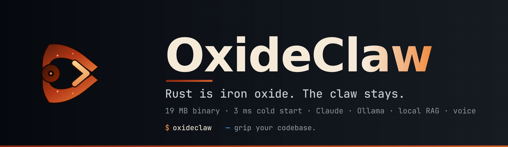

<p align="center">
  
</p>

<p align="center">
  <a href="https://github.com/ForkedInTime/OxideClaw/releases"></a>
  <a href="https://github.com/ForkedInTime/OxideClaw/actions/workflows/ci.yml"></a>
  <a href="LICENSE"></a>
  <a href="https://www.rust-lang.org"></a>
</p>

<h3 align="center">OxideClaw is a provider-neutral coding agent that indexes your repo, caps your spend, and works offline with Ollama.</h3>

<p align="center">
  Claude, Ollama, and 10 OpenAI-compatible providers (Gemini among them). One ~19 MB binary; the Linux musl build is fully static.<br>
  No account, no gateway, no telemetry: your keys go straight to your provider.<br>
  Optional local voice-cloning add-on (Python; XTTS weights are non-commercial).<br>
  <sub>Rust is iron oxide. The claw stays.</sub>
</p>

<p align="center"><sub>Formerly <b>RustyClaw</b> (renamed 2026-09-11). Existing installs keep working: <code>RUSTYCLAW_*</code> settings are still read, and config, sessions, index and undo history move to the new name on first run.</sub></p>

<p align="center">
  
</p>

---

## Install

**Linux / macOS:**
```bash
curl -fsSL https://raw.githubusercontent.com/ForkedInTime/OxideClaw/main/install.sh | bash
```

**Windows (PowerShell):**
```powershell
Invoke-WebRequest https://github.com/ForkedInTime/OxideClaw/releases/latest/download/oxideclaw-windows-x64.exe -OutFile oxideclaw.exe
```
Then move `oxideclaw.exe` somewhere on your `PATH` (e.g. `%USERPROFILE%\bin`).

**Arch Linux (AUR):**
```bash
yay -S oxideclaw-bin
```

**Homebrew (macOS / Linux):**
```bash
brew install ForkedInTime/oxideclaw/oxideclaw
```

**npm (downloads the release binary, verifies its checksum):**
```bash
npm install -g oxideclaw
```

**Cargo (builds from source, any platform with Rust 1.88+):**
```bash
cargo install oxideclaw
```

**Docker (x86_64, from GitHub Container Registry):**
```bash
docker run --rm -it --user "$(id -u):$(id -g)" -e HOME=/tmp \
  -e ANTHROPIC_API_KEY -v "$PWD:/work" ghcr.io/forkedintime/oxideclaw
```
`--user` runs as you, so the agent can edit your bind-mounted files whatever your uid; `HOME=/tmp` gives that uid a writable home for config and sessions.

**Verify a download** (releases after v0.4.0 carry `SHA256SUMS` and signed build provenance):
```bash
base=https://github.com/ForkedInTime/OxideClaw/releases/latest/download
curl -fsSLO "$base/oxideclaw-linux-x64"
curl -fsSLO "$base/SHA256SUMS"
sha256sum -c --ignore-missing SHA256SUMS          # macOS: shasum -a 256 -c --ignore-missing SHA256SUMS
gh attestation verify oxideclaw-linux-x64 --repo ForkedInTime/OxideClaw
```
On Windows (PowerShell), print the hash and compare it with the `oxideclaw-windows-x64.exe` line in `SHA256SUMS`; `gh attestation verify` works the same there:
```powershell
(Get-FileHash oxideclaw-windows-x64.exe -Algorithm SHA256).Hash.ToLower()
gh attestation verify oxideclaw-windows-x64.exe --repo ForkedInTime/OxideClaw
```
`SHA256SUMS` catches a corrupted download; `gh attestation verify` checks the Sigstore-signed provenance that ties the file's digest to this repository's release workflow, so a binary uploaded by hand or altered later fails. Swap in your platform's asset name.

<details>
<summary>Other install methods</summary>

**From source (Rust 2024 edition):**
```bash
git clone https://github.com/ForkedInTime/OxideClaw.git
cd OxideClaw && cargo build --release
./target/release/oxideclaw
```

**Specific version (Linux/macOS):**
```bash
curl -fsSL https://raw.githubusercontent.com/ForkedInTime/OxideClaw/main/install.sh | bash -s v0.4.0
```

Pre-built binaries attached to every [release](https://github.com/ForkedInTime/OxideClaw/releases):
- Linux: `x86_64-linux-gnu`, `aarch64-linux-gnu` (glibc 2.28+: Ubuntu 20.04, Debian 10, RHEL 8 or newer), `x86_64-linux-musl` (static, any distro, including glibc older than 2.28)
- macOS: `x86_64-apple-darwin` (Intel), `aarch64-apple-darwin` (Apple Silicon)
- Windows: `oxideclaw-windows-x64.exe`

Releases after v0.4.0 stay a draft until the x86_64 gnu binary has run on Debian 10 and Rocky Linux 8 (both glibc 2.28), Ubuntu 22.04, Debian 12 and Rocky Linux 9, and the musl binary on Alpine.
</details>

**Linux / macOS:**
```bash
echo 'ANTHROPIC_API_KEY=sk-ant-...' >> ~/.env
oxideclaw
```

**Windows (PowerShell):**
```powershell
Add-Content -Path $HOME\.env -Value 'ANTHROPIC_API_KEY=sk-ant-...' -Encoding ascii
oxideclaw
```

---

## Why OxideClaw?

OxideClaw is a coding agent, not a port. It talks to Claude, Ollama, and 10 OpenAI-compatible providers (Gemini, DeepSeek, Groq, OpenRouter and more), and `/model` switches between them mid-session. Three things no other agent ships together: a code index that builds itself (tree-sitter + SQLite FTS5, no embeddings, no account), a `/budget` hard stop you can set mid-session that counts sub-agents, and replies spoken locally in a voice you record (an optional add-on). The rest (worktree agents, an auto-fix loop, `/undo` + `/redo`, a browser agent, MCP, ACP) is what good agents ship, and OxideClaw has it too.

How it compares with the agents people actually run. Competitor cells were checked against each project's docs, README or source on 2026-10-06.
✅ yes · ◐ partial · ❌ no · — not checked.

| | Claude Code | Codex CLI | Copilot CLI | OpenCode | Aider | **OxideClaw** |
|---|---|---|---|---|---|---|
| Runtime | JavaScript (Bun-bundled binary) | Rust | JavaScript (Node.js) | TypeScript (Bun) | Python | **Rust, one binary** |
| License | Proprietary | Apache-2.0 | Proprietary | MIT | Apache-2.0 | **Apache-2.0** |
| Code index built in, on by default, local, no embeddings | ❌ | ❌ | ◐ trigram grep index | ❌ | ◐ tree-sitter repo map, no search index | **✅ tree-sitter + FTS5/BM25, 8 languages** |
| `/budget` hard stop you can set mid-session | ◐ `--max-budget-usd`, print mode only | ❌ | ◐ billing-level limits | ❌ | ❌ | **✅ any provider, counts sub-agents** |
| Replies spoken locally in a voice you record | ❌ | ◐ realtime voice, cloud, preset voices | ❌ | ❌ | ❌ | **✅ optional add-on (XTTS v2, Python)** |
| Auto model routing | ❌ | — | ✅ Auto | — | ❌ | **◐ opt-in, keyword heuristic, Claude tiers by default** |
| Auto-fix loop (lint + tests + retry after edits) | ◐ | — | — | — | ✅ | **✅ runners detected with zero config; trusted projects only** |
| `/undo` | ✅ `/rewind` (alias `/undo`) | — | ✅ | ✅ | ✅ reverts its own commit | **✅ private git refs, no commits on your branches** |
| `/redo` after `/undo` | ❌ | ❌ | ❌ | ✅ | ❌ | **✅** |
| Parallel agents in git worktrees | ✅ | ✅ on by default | ✅ | — | — | **✅ `spawn`, up to 8** |
| Autonomous browser agent (`/browse <goal>`) | ✅ Chrome extension, claude.ai plan required | — | — | ◐ v2 desktop app only | ❌ | **✅ any provider, 50-step cap, approval gate** |
| Voice input | ✅ | ◐ realtime, cloud | ✅ local | — | ✅ `/voice` | **✅ Whisper** |
| Ollama with native tool calling | ◐ via Ollama's Anthropic-compatible API | — | ✅ BYOK or offline | ✅ | ◐ edit formats, no tool calls | **✅ no shim, no login** |
| OpenAI-compatible providers | ❌ | ◐ Responses API only | ✅ BYOK | ✅ 75+ providers | ✅ | **✅ 10 providers** |
| MCP servers | ✅ | ✅ | ✅ | ✅ | ❌ | **✅ `2024-11-05` spec** |
| Editor integration (Agent Client Protocol) | via adapter | — | ✅ | ✅ | — | **✅ `oxideclaw acp`** |
| Sandboxed shell | ✅ Seatbelt / bwrap | ✅ every OS | — | — | — | **◐ Linux only (bwrap / firejail)** |
| AGENTS.md | ✅ | ✅ | ✅ | ✅ | ◐ via `read:` config | **✅ plus CLAUDE.md, `/reload`** |

Only the first three rows are OxideClaw's alone, and only as worded there. Every other row is shared, and on some of them OxideClaw is the partial one.

---

## Feature tour

### 🧠 &nbsp; Local codebase RAG — zero setup

tree-sitter AST parsing, SQLite FTS5 (BM25) full-text search over tree-sitter symbol chunks. Index your whole repo in seconds; it updates incrementally before each prompt.

The index follows git's rules: anything `.gitignore`, `.git/info/exclude`, your global excludes file or an `.ignore` file leaves out is never indexed, so it never reaches a model. It builds on its own only inside a git repository, and never for your home directory or `/`. It lives outside the project, in `$XDG_CACHE_HOME/oxideclaw/rag/` (default `~/.cache/oxideclaw/rag/`), one database per project.

```
> /rag search TOCTOU
RAG search: 'TOCTOU' — 1 results

  src/session/mod.rs:247-258 (function `load_messages`, rust)
```

### 💰 &nbsp; Live cost dashboard, `/budget` hard stop, optional router

Every token is priced in real time. Cap the bill with `/budget $5` at any point in a session (or `routerBudget` in settings.json): OxideClaw warns at 80% and stops the loop when the budget is exceeded, counting sub-agents and background agents against the same cap.

The smart router is optional and off by default. `/router on` sends each prompt to a tier picked by a keyword and length heuristic; the default tiers are Claude models (Haiku, Sonnet, your current model, Opus), and `/router low <model>` points a tier at any provider, Ollama included.

### 🎭 &nbsp; Parallel agents in git worktrees

```
/spawn refactor the auth middleware
# runs in an isolated git worktree while you keep working in the main tree
# /spawn list · /spawn review <id> · /spawn merge <id> · /spawn discard <id>
```

### 🎤 &nbsp; Voice I/O with XTTS v2 cloning

Push-to-talk speech input (Whisper). Spoken replies in any voice, including a clone of your own: `/voice clone` records a 10-second, 60-second or 5-minute sample. XTTS v2 runs locally, so your voice never leaves the machine; long replies are trimmed to 200 words. **The only coding agent with a built-in record-your-voice flow that speaks every reply locally.**

Voice is an optional add-on that needs Python + Coqui. XTTS v2 weights are licensed under CPML (non-commercial use only).

### ♻️ &nbsp; Auto-fix loop

In trusted projects, every edit triggers a lint and test cycle. Untrusted projects skip it until you run /trust. The cycle uses the project's own runner (clippy, ESLint, ruff, `go vet`; `cargo test`, `npm test`, pytest, `go test`) when it is installed, or your `lintCommand`/`testCommand`, and runs inside the same sandbox as the Bash tool when you have one enabled. Those commands execute the project's code (`build.rs`, `conftest.py`, npm scripts), which is why trust comes first. Failures feed back into the next turn for up to three retries, with an explicit instruction not to silence lints or weaken tests. The old rollback-on-fail behaviour is gone — OxideClaw fixes forward.

### ↩️ &nbsp; `/undo` and `/redo` on shadow refs

Every assistant turn silently snapshots the working tree to `refs/oxideclaw/sessions/<id>/<n>`: per-turn snapshots on private git refs in your own repo, with no commits on your branches, hidden from default `log`/`branch`/`status`, and HEAD and index never moved. (They do show in `git log --all`, and `git push --mirror` would push them.) Use the `/undo` picker or skip straight to a turn with `/undo 3`; files the undone turns created are removed and come back on `/redo`. The session base keeps the uncommitted work you started with, and edits you make between turns are saved to `refs/oxideclaw/recovery/<session>` before an `/undo` or `/redo` overwrites them. `/redo` works like OpenCode's and Kilo's; Claude Code, Codex, Gemini CLI, Copilot CLI and Cursor CLI have no redo.

### 🔌 &nbsp; Works offline via Ollama — with working tool use

Native Ollama tool calling, with no Anthropic-compat shim and no login. Tool calls go over Ollama's own OpenAI-compatible endpoint, so local models can read, edit, and run things. A model without tool support is detected on its first request and drops to text-only chat (no file or command access) for the rest of the session.

### 🌐 &nbsp; Built-in browser automation — no extra server

Nine CDP-driven tools — `browser_navigate`, `browser_snapshot`, `browser_click`, `browser_fill`, `browser_screenshot`, `browser_get_text`, `browser_press_key`, `browser_wait`, `browser_console` — shipped in the binary and enabled by default. Snapshots return a text tree with stable `@eN` element refs you can pass to click/fill, plus the page's own text (about 8k characters, nearest the controls and headings first), fenced and labelled as untrusted page content. Chrome reaches a dev server on `localhost` after you approve that `host:port` once (or with `allowPrivateNetworkFetch: true`), never the cloud metadata service. Works against any Chromium-based browser (Chrome, Chromium, Brave, Edge) you already have installed. No external automation server, no separate install.

### 🤖 &nbsp; Autonomous browser mode — `/browse <goal>`

Give it a goal, it drives. `/browse find the cheapest flight SF to Tokyo on July 7` navigates, fills forms, scrolls, reads results, and speaks the answer. 50-step hard cap (configurable), destructive-action approval gate (pauses at payment / delete / OAuth / free-trial-autobill), stagnation detector (escalating nudges when the model is stuck). `oxideclaw browse "<goal>"` runs the same loop headless from scripts or CI, streaming progress as NDJSON and ending with a JSON result. `/voice` with prefixes `browse | browser | web | go to | open | shop for | book | order` drives it hands-free with milestone TTS at start, gate trip, and end.

### 🦀 &nbsp; Single ~19 MB binary

The core agent needs no runtime and no post-install scripts. `scp` it to a server and run. The Linux musl build is fully static; the gnu builds need glibc 2.28+. The optional voice add-on needs Python. Every release ships Linux (gnu, musl, aarch64), macOS (Intel, Apple Silicon), and Windows builds with SHA-256 digests, and `oxideclaw update` verifies them. Once a day the TUI asks GitHub in the background whether a newer release exists and, if so, says so in one dim line; `"updateCheck": false` in settings.json or `OXIDECLAW_NO_UPDATE_CHECK=1` turns that off.

### 🪝 &nbsp; Lifecycle hooks

Run your own shell commands at eight points: `preToolUse` (exit 2 blocks the tool), `postToolUse`, `userPromptSubmit` (stdout becomes extra context, exit 2 keeps the prompt from being sent), `notification`, `stop`, `sessionStart`, `preCompact`, `postCompact`. Match one tool or `*`. Hooks get the event in environment variables (`TOOL_NAME`, `TOOL_INPUT`, `TOOL_RESULT`, `CLAUDE_MESSAGE`, `CLAUDE_SESSION_ID`, `CLAUDE_CWD`), plus the full uncapped event as JSON on stdin (`tool_name`, `tool_input`, `tool_response`, `prompt`), and may print JSON to block, add a system message, or stop the turn. 60-second timeout, own process group, `--bare` skips them all. In `-p`, `--headless` and `oxideclaw acp`, the tool and `userPromptSubmit` hooks run as well; `notification`, `stop`, `sessionStart` and the compact hooks are interactive-only.

```json
{ "hooks": { "preToolUse": [ { "matcher": "Bash", "command": "./scripts/guard.sh" } ] } }
```

### 🧩 &nbsp; Editor integration — Agent Client Protocol

`oxideclaw acp` speaks the [Agent Client Protocol](https://agentclientprotocol.com) over stdio, so Zed, JetBrains, and any ACP client can use OxideClaw as their coding agent: streamed replies and thoughts, live tool-call status, permission prompts in the editor's own UI, and mid-turn cancel. In Zed:

```json
{ "agent_servers": { "OxideClaw": { "command": "oxideclaw", "args": ["acp"] } } }
```

### 🛡️ &nbsp; Sandbox-first execution

Shell commands can run under `bwrap` or `firejail` (Linux namespace isolation; set `"sandboxAllowNetwork": false` to cut the network), or a `strict` mode that is only a best-effort denylist of catastrophic commands with no filesystem or network isolation (the only mode on macOS/Windows). Approvals last for the session: `[a]lways` trusts the whole tool (for Bash, every shell command) until you quit; use `permissions.allow` rules such as `Bash(git:*)` for narrower trust, or pass the same rules for one run with `--allowed-tools 'Bash(git status:*)'` and `--disallowed-tools 'Bash(git push:*)'`. Edits and commands prompt by default; `/autonomy auto-edit` lets edits inside the project through without a prompt (never to `.git/`, `.env*`, CI, hook or build/test config), and `/autonomy full-auto` drops the prompts entirely, only under `bwrap` (which leaves only the project writable; `firejail` does not qualify) and never when started in `$HOME`. Deny rules hold in every mode.

### 📁 &nbsp; Config, CLAUDE.md and AGENTS.md

XDG Base Directory compliant, and OxideClaw's own: settings live in `~/.config/oxideclaw/settings.json` (`$XDG_CONFIG_HOME/oxideclaw`; `$OXIDECLAW_CONFIG_DIR` overrides), sessions in `~/.local/share/oxideclaw/sessions` (`$XDG_DATA_HOME/oxideclaw`), the code index in `~/.cache/oxideclaw` (`$XDG_CACHE_HOME/oxideclaw`). Claude Code's `~/.claude` is never written: OxideClaw reads its `CLAUDE.md`, `AGENTS.md`, skills and agents as an import format, copies its own old state out of it once on first run, keeps the settings that only tighten (deny rules, `sandboxEnabled: true`, `autonomy: "suggest"`, a disabled auto-fix loop, ...), and imports hooks, allow rules or MCP servers only when you run `oxideclaw config import-claude`. Reads **both** `CLAUDE.md` and `AGENTS.md`. Hot-reload with `/reload` — no restart. Skills use the standard [Agent Skills](https://agentskills.io) `<name>/SKILL.md` layout from `.agents/skills/`, `.oxideclaw/skills/`, `.claude/skills/`, the config directory and `~/.claude/skills/`; only each skill's name and description load up front, and the body is read when it runs.

See **[FEATURES.md](FEATURES.md)** for the complete reference (30+ tools, 60+ slash commands, every config knob).

---

## Quick start

```bash
# First-run setup
oxideclaw /init         # generates CLAUDE.md from your repo
oxideclaw /doctor       # verifies API keys, models, and sandbox

# Day-to-day
oxideclaw               # interactive TUI
oxideclaw --headless    # NDJSON stdio for editor/CI embedding (see sdk/)
oxideclaw acp           # Agent Client Protocol over stdio (Zed, JetBrains, any ACP client)

# Inside the TUI
/help                   # interactive command menu
/model                  # pick a model (Claude + Ollama + 10 OpenAI-compat providers)
/rag search <query>     # full-text codebase search
/budget $5              # cap the bill
/voice                  # voice I/O + TTS picker
/spawn <task>           # parallel agent in a git worktree
/undo                   # step back to any previous turn
```

No API key yet? If Ollama is running locally (or at `OLLAMA_HOST`) and you have not picked a model, `oxideclaw` and `oxideclaw -p` start on one of your pulled Ollama models, preferring one that supports tools, and say which.

`.env` files auto-load from `$CWD/.env`, `~/.env`, or `.env` in the config dir (`~/.config/oxideclaw/.env`). A project `.env` can set `OLLAMA_HOST` and `ANTHROPIC_MODEL` only after you `/trust` that folder.

---

## What it looks like

<details open>
<summary>Screenshots</summary>
<br>
<table>
<tr>
<td width="50%">

**Streaming codebase conversation**


</td>
<td width="50%">

**Completed response with cost tracking**


</td>
</tr>
<tr>
<td width="50%">

**Codebase RAG search**


</td>
<td width="50%">

**Model picker — Claude + Ollama + OpenAI-compat**


</td>
</tr>
<tr>
<td width="50%">

**Session manager**


</td>
<td width="50%">

**Interactive help**


</td>
</tr>
<tr>
<td width="50%">

**Doctor diagnostics**


</td>
<td width="50%">

**Cost dashboard**


</td>
</tr>
<tr>
<td width="50%">

**Voice I/O — XTTS v2**


</td>
<td width="50%">

**Keybindings overlay**


</td>
</tr>
</table>
</details>

---

## Documentation

| Document | Description |
|----------|-------------|
| [FEATURES.md](FEATURES.md) | Complete feature reference — every command, shortcut, and config option |
| [BENCHMARKS.md](BENCHMARKS.md) | Startup and footprint vs Claude Code, Codex, Gemini CLI, Goose — with the script to reproduce |
| [sdk/](sdk/) | SDK / headless mode — protocol, examples, integration guide |
| [CHANGELOG.md](CHANGELOG.md) | Release history |
| [CONTRIBUTING.md](CONTRIBUTING.md) | How to contribute |
| [SECURITY.md](SECURITY.md) | Security policy and vulnerability reporting |

---

## License

Apache 2.0 — see [LICENSE](LICENSE).

---

<p align="center">
  <br>
  <sub>Built on Arch Linux. No rust was harmed in the making of this binary.</sub>
</p>
